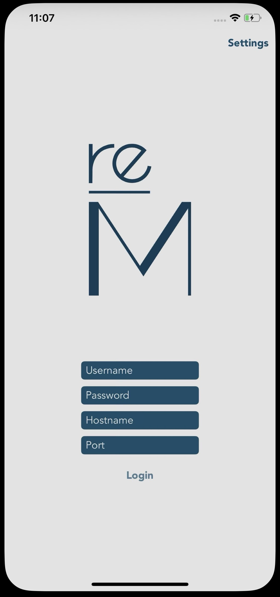
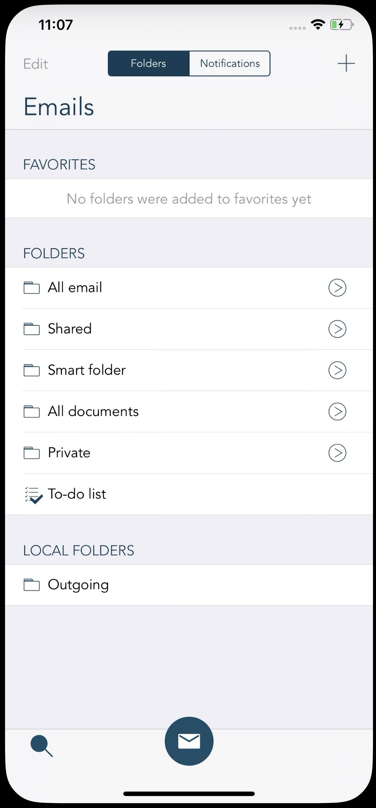
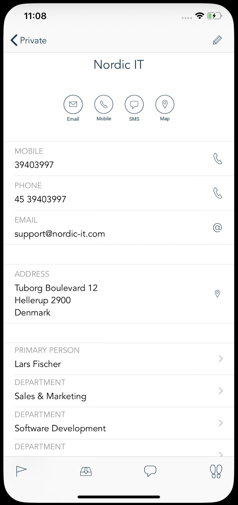
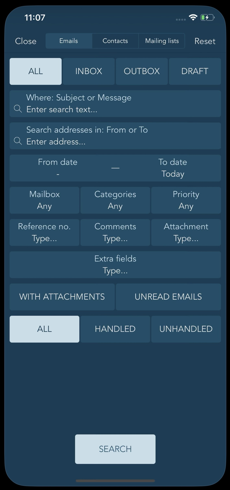

# reMARK Mobile

Enterprise email and collaboration application for iOS and Android, built with Xamarin.

reMARK is designed for organizations that manage high volumes of shared mailbox communication, providing access to emails, contacts, mailing lists, tasks, and document workflows from mobile devices.

---

## Overview

reMARK Mobile extends the reMARK enterprise communication platform to mobile devices, enabling teams to work efficiently with shared email addresses and collaborative inboxes.

The application provides secure access to organizational communication and document management workflows while supporting both online and offline operation.

---

## Features

### 📧 Email Management

- Send, receive, reply and forward emails
- Browse shared mailboxes and folders
- Mark emails as read/unread
- Assign categories and labels
- Advanced email search
- Email filtering
- Download attachments
- Email templates

### 👥 Contacts & Mailing Lists

- Browse contacts
- Access organizational mailing lists
- Search contacts and groups
- View detailed contact information

### 🤝 Collaboration

- Shared inbox support
- Folder management
- Favorites and quick access folders
- Comments on emails and contacts
- Work tray integration
- Task and action management

### 🔔 Notifications

- Push notifications
- Folder-specific notifications
- Background synchronization

### 📶 Offline Support

- Work without internet connection
- Local data caching
- Automatic synchronization when connectivity is restored

---

## Screenshots

| Login | Folder Navigation | Email Viewer | New Contact | Search |
|---------|---------|---------|---------|---------|
|  |  |  | |  |

> Create a `docs/screenshots` folder and place your screenshots there.

---

## Technology Stack

### Mobile

- Xamarin.iOS
- Xamarin.Android
- C#
- .NET

### Architecture

- Shared business logic layer
- Platform-specific UI implementations
- Service-oriented backend integration

### Libraries & Tools

- Fastlane
- SVProgressHUD
- TinyMessenger
- FastScroller

---

## Project Structure

```text
reMARK.Mobile/
│
├── reMark.Mobile.Common/
├── reMark.Mobile.Classes/
├── reMark.ServiceReference/
│
├── reMark.Mobile.IOS/
├── reMark.Mobile.Droid/
│
├── reMARK.Mobile.IOS.Extensions.*
│   ├── Share Extension
│   └── Call Identification Extension
│
├── fastlane/
├── SVProgressHUD/
├── TinyMessenger/
└── FastScroller/
```

---

## Solution Components

| Project | Description |
|----------|-------------|
| reMark.Mobile.Common | Shared application logic |
| reMark.Mobile.Classes | Domain models and business entities |
| reMark.ServiceReference | Backend service integrations |
| reMark.Mobile.IOS | iOS application |
| reMark.Mobile.Droid | Android application |
| reMARK.Mobile.IOS.Extensions.* | iOS extensions |

---

## Development Setup

### Prerequisites

- Visual Studio
- Xamarin SDK
- Xcode
- Android SDK
- .NET SDK
- CocoaPods (if required)

### Clone Repository

```bash
git clone <repository-url>
cd reMARK.Mobile
```

### Open Solution

```text
reMark.sln
```

### Build

#### iOS

```bash
msbuild reMark.Mobile.IOS.csproj
```

#### Android

```bash
msbuild reMark.Mobile.Droid.csproj
```

---

## Deployment

### iOS

```bash
fastlane ios beta
fastlane ios release
```

### Android

```bash
fastlane android beta
fastlane android release
```

---

## User Capabilities

- Manage shared team inboxes
- Process large volumes of email
- Collaborate on customer communication
- Access contacts and mailing lists
- Work with attachments and templates
- Receive real-time notifications
- Continue working offline

---

## Security

- Enterprise authentication
- Secure communication with backend services
- Protected local storage
- Role-based access through the reMARK platform

---

## My Contributions

As Senior Mobile Developer, I contributed to:

- Xamarin iOS development
- Xamarin Android development
- Shared code architecture
- Backend integrations
- Push notifications
- Offline synchronization
- Feature development and maintenance
- Fastlane CI/CD automation
- App Store and Play Store releases
- Production support and troubleshooting

---

## Business Value

reMARK helps organizations:

- Centralize team communication
- Improve response times
- Manage shared email accounts efficiently
- Reduce duplicated work
- Maintain communication history
- Enable mobile productivity for distributed teams

---

## License

This repository is provided for portfolio and demonstration purposes only.

Original product and intellectual property belong to Nordic IT.
